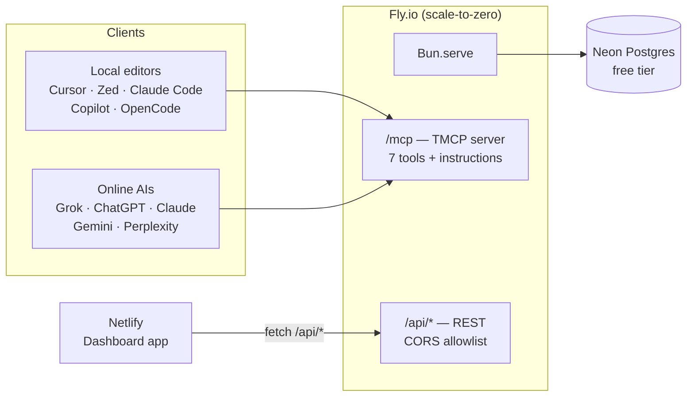

# Sepia

[](banner.svg)

[](LICENSE) [](https://www.npmjs.com/package/sepia-mcp) [](https://www.npmjs.com/package/sepia-mcp) [](https://bun.sh) [](https://svelte.dev) [](https://www.typescriptlang.org) [](https://github.com/Michael-Obele/sepia)

_remember everything — self-hosted memory for AI agents_
Turn every session into durable memory. One server, 7 tools, $0/mo.

[Quick start](#getting-started) · [Why Sepia](#why-sepia) · [The 7 Tools](#the-7-tools) · [Architecture](#architecture) · [Connect an AI](#connect-clients) · [Dashboard](#the-dashboard) · [Costs](#costs)

## Why Sepia

If you're re-explaining preferences every chat or paying SaaS per memory, you're overpaying.

| What hurts with alternatives                            | What Sepia gives you                                                               | Outcome                              |
| ------------------------------------------------------- | ---------------------------------------------------------------------------------- | ------------------------------------ |
| **Local JSONL** — no remote, no search across sessions  | **Remote knowledge graph** — entities, relations, memories with importance scoring | Recall from any editor or web AI     |
| **17-tool SaaS** + RBAC, audit trails, per-seat pricing | **7 tools, not 17** — `action` enums, pure-SQL `prune_memories`, no team bloat     | Small LLM surface, $0/mo self-hosted |
| **No memory contract** — you re-prompt every session    | **Instructions + always-on files + Skill** — auto-injected usage contract          | Remember without being asked         |
| **No dashboard** — raw JSONL or vendor UI               | **SvelteKit dashboard** — search, graph, CRUD, conversations                       | Browse the same data agents write    |

## Features

| Feature                       | What it does                                                                                                                                                                                                                                                                                                |
| ----------------------------- | ----------------------------------------------------------------------------------------------------------------------------------------------------------------------------------------------------------------------------------------------------------------------------------------------------------- |
| 🧠 **Knowledge graph**        | Entities (nodes), weighted relations (edges), memories (facts/observations) with importance scoring, in isolated namespaces                                                                                                                                                                                 |
| 🔎 **Search + traversal**     | Unified keyword search across everything; BFS graph traversal from any entity                                                                                                                                                                                                                               |
| 🧹 **`prune_memories`**       | Destructive maintenance sweep: decay-scoring, dedup, purge — pure SQL, no LLM calls. Requires `confirm: true` — **never a way to save memory**                                                                                                                                                              |
| 📋 **Server instructions**    | A usage contract sent in the MCP `initialize` handshake; supporting clients (Claude Code, Codex, Copilot, Goose) inject it into the system prompt — zero-reminder usage                                                                                                                                     |
| ⚡ **Always-on instructions** | `skills/sepia/always-on/` — VS Code `*.instructions.md` (`applyTo: '**/*'`), Cursor `.mdc` (`alwaysApply: true`), `~/.claude/CLAUDE.md`, `AGENTS.md`; injected into **every** session, covering clients that ignore `instructions` (Cursor)                                                                 |
| 🛠️ **Bundled Agent Skill**    | `skills/sepia/SKILL.md` (agentskills.io standard) — works in Zed, Cursor, Claude Code, Codex, OpenCode; the on-demand extended guide (tool-by-tool detail)                                                                                                                                                  |
| � **Conversation migration**  | `manage_memory` action=ingest — save a distilled handoff digest (summary + decisions + preferences + entities) that any other AI can resume; digests are protected from consolidation and grouped by `conversation_id`                                                                                      |
| 🖥️ **Web dashboard**          | SvelteKit app on Netlify (SSR + remote functions): landing + pricing pages, search with URL-backed filters, graph view, conversations, stats, and a "Connect an AI" page — never wakes the API's scaled-to-zero machine                                                                                     |
| 🌐 **Online AI support**      | Grok, ChatGPT, Claude web, Gemini (Spark), Perplexity, Le Chat all accept remote MCP connectors — your memory follows you to the web                                                                                                                                                                        |
| 📊 **Opt-in telemetry**       | **Off by default and not recommended** — records counters (optionally query text, 30-day TTL) **inside your own database** so zero-result searches, repeated queries and briefing adoption become visible. No third-party endpoint; view or erase it any time. See [Security & Privacy](#security--privacy) |
| 🔐 **Two-phase auth**         | Phase 1: static Bearer token (local editors). Phase 2: **OAuth 2.1 + PKCE live** — built-in authorization server via `@tmcp/auth` (login page, dynamic client registration, Client ID Metadata Documents) for Grok/ChatGPT/Gemini-style connectors. Hosted accounts with plans are in progress              |

## Architecture

```
                        ┌─────────────────────────────────┐
                        │         Browser (you)            │
                        │  sepia.svelte-apps.me            │
                        │  Dashboard (SvelteKit SSR,       │
                        │  served from Netlify)            │
                        └───────────────┬─────────────────┘
                                        │ HTTPS + Bearer token / PKCE
                                        ▼
┌────────────────────────┐   ┌────────────────────────────────────┐
│       MCP Clients       │   │       Fly.io App (Bun.serve)       │
│                         │   │                                    │
│  Local: Cursor, Zed,    │──▶│  /mcp     TMCP server (7 tools +   │
│  Claude Code, Copilot,  │   │           instructions)            │
│  OpenCode               │   │  /api/*   REST (same auth, CORS    │
│  Web: Grok, ChatGPT,    │   │           allowlist)               │
│  Claude.ai, Gemini,     │   └───────────────┬────────────────────┘
│  Perplexity             │                   │ @neondatabase/serverless
└────────────────────────┘                   ▼
                              ┌────────────────────────────────────┐
                              │      Neon Postgres (Free Tier)      │
                              │  namespaces · entities · relations  │
                              └────────────────────────────────────┘
```

**Stack:** Bun · TMCP (Valibot adapters, `HttpTransport`) · Neon Postgres · **Drizzle ORM** (type-safe query builder + `sql` template + migrations) · Svelte 5/SvelteKit (`adapter-netlify`, SSR + remote functions) · Tailwind CSS v4 · cytoscape.js

**Key decision:** the MCP endpoint and the REST API share **one Bun process** on **one Fly.io machine** — TMCP's `HttpTransport` mounts at `/mcp` inside an existing `Bun.serve`. The dashboard is a **SvelteKit app on Netlify** (SSR + remote functions): free tier, and it never wakes the Fly VM (which scales to zero) — the machine only spins up for real API calls from agents.



## The 7 Tools

7 tools, not 17 — resource-oriented (`action` enum).

| #   | Tool               | Actions                                                  | What it does                                                                 |
| --- | ------------------ | -------------------------------------------------------- | ---------------------------------------------------------------------------- |
| 1   | `manage_namespace` | create, list, get, delete                                | Organize memory into isolated spaces                                         |
| 2   | `manage_entity`    | create, get, update, delete, find, batch_update          | Knowledge graph nodes (people, concepts, projects, tools)                    |
| 3   | `manage_relation`  | create, delete, list                                     | Directed, weighted edges between entities                                    |
| 4   | `manage_memory`    | create, get, update, delete, query, batch_update, ingest | Facts/observations/preferences with importance scoring; conversation digests |
| 5   | `search`           | —                                                        | Unified keyword + metadata search across all data                            |
| 6   | `traverse_graph`   | —                                                        | BFS walk of the knowledge graph from an entity                               |
| 7   | `prune_memories`   | confirm: true                                            | Decay sweep + dedup + purge (destructive maintenance, never a save)          |

**Why 7 instead of 17:** FlarelyLegal's 17 tools split entity search, memory queries, conversations, and admin into separate tools. By using `action` enums inside `manage_*` tools, the LLM surface stays clean while covering all capabilities — including conversation migration (`manage_memory` action=ingest) and bulk updates (`batch_update`). No RBAC, no audit trails — those are team features a personal server doesn't need. Semantic/vector search is a deliberate future upgrade; `search` ships keyword + metadata for v1.

## Remember Without Being Asked

Three complementary channels, one contract (`src/instructions.ts`):

1. **MCP `instructions` field** — the server sends a usage contract in the `initialize` handshake; clients that support it (Claude Code, Codex, VS Code Copilot Chat, Goose, Claude Desktop) inject it into the model's system prompt. The model recalls before working and persists after learning — no reminder prompts.
2. **Always-on instruction files** (`skills/sepia/always-on/`) — the same condensed contract, installed into each editor's own instruction system: VS Code `*.instructions.md` with `applyTo: '**/*'` (auto-attached to every chat request), Cursor `.mdc` with `alwaysApply: true` (every session, unconditionally), a section in `~/.claude/CLAUDE.md` (loaded at session start), and an `AGENTS.md` section for Codex/other agents. Skills are on-demand by design in every platform, so this channel is what actually **forces** memory usage in editors that ignore `instructions` (Cursor).
3. **Bundled Agent Skill** (`skills/sepia/SKILL.md`) — the extended guide (tool-by-tool detail, examples, edge cases), delivered through the open Agent Skills standard. Loads when memory is relevant.

The contract teaches: **search before meaningful work**, **persist durable facts** (preferences, decisions, conventions), **prefer update over duplicate**, **link memories to entities**, **score importance 0–1**, **never store credentials or ephemeral chat content** — and **migrate conversations between AIs** via `manage_memory` action=ingest (handoff digests with status: active/paused/done).

## The Dashboard

A SvelteKit app at `sepia.svelte-apps.me` (SSR + remote functions on Netlify), talking to the same database through `/api/*`:

- 🏠 **Landing + pricing pages** — what Sepia is, how to install it, and the hosted plan
- 🔍 Search all memories/entities; browse by namespace, type, importance — filters persist in the URL (back/forward works)
- 🕸️ Interactive knowledge-graph view (layerchat)
- ✏️ CRUD on memories, entities, and relations from the browser
- 💬 **Conversations** — browse handoff digests by status (active/paused/done), resume or delete them
- 📊 Stats: counts, top entities, recent memories, decay/consolidation status
- 🔗 **Connect an AI** page: copy-paste configs for Grok, ChatGPT, Claude, Gemini, Perplexity, and the local editors

## Project Structure

A **Bun workspace monorepo**: one repo, one lockfile, three deploy entries — Fly.io builds the server from the root `Dockerfile`, Netlify builds `dashboard/` from `netlify.toml`, and the skill is installed by a script (no build).

```
sepia/                                # Bun workspace monorepo
├── package.json                      # root scripts (dev, deploy:*)
├── bun.lock                          # ONE lockfile for the whole repo
├── Dockerfile                        # Fly.io entry — installs only the server's deps (--filter)
├── fly.toml                          # scale-to-zero config
├── netlify.toml                      # builds dashboard/, publishes dashboard/build
├── .env.example
├── src/                              # SERVER (deployed by Fly.io)
│   ├── index.ts                      # Bun.serve: mounts /mcp + /api/* + /api/auth/* (CORS)
│   ├── instructions.ts               # The memory contract (system-prompt injection)
│   ├── auth.ts                       # Bearer token (Phase 1) / OAuth guard (Phase 2)
│   ├── oauth.ts                      # OAuth 2.1 authorization server (@tmcp/auth)
│   ├── rate-limit.ts                 # per-user sliding-window rate limits
│   ├── db.ts                         # Drizzle client (lazy init) + MemoryError
│   ├── tools/                        # 7 tools, one file each
│   ├── lib/                          # CRUD + search + BFS + decay (shared by tools & API)
│   └── api.ts                        # /api/* router (same auth as /mcp)
├── drizzle/                          # Drizzle migrations (generated by drizzle-kit)
│   ├── 0000_*.sql                    # baseline (introspected from the live schema)
│   └── 0001_*.sql                    # constraints + trigram indexes (see below)
├── packages/
│   └── shared/                       # @sepia/shared — Valibot schemas + types, no build step
│       ├── src/{schemas,types}.ts    # single source of truth for tools, API, and dashboard
│       └── src/db/                   # Drizzle schema + owner-scoped CRUD libs (plans, users)
├── dashboard/                        # DASHBOARD (deployed by Netlify)
│   └── src/routes/                   # (public)/ landing + pricing, app/ search, memories,
│                                     # entities, conversations, graph, connect, settings
├── skills/
│   └── sepia/                        # SKILL (static, installed by script)
│       ├── SKILL.md
│       ├── always-on/                # per-editor instruction files (vscode, cursor, claude…)
│       └── references/tools.md       # generated from @sepia/shared schemas
├── sql/schema.sql                    # namespaces · entities · relations · memories · oauth_clients
└── scripts/
    ├── install-skill.sh              # copies the skill into every editor dir it finds
    └── gen-skill-ref.ts              # regenerates references/tools.md from shared schemas
```

`@sepia/shared` is imported as TypeScript directly (no build step) by both the server (Bun) and the dashboard (Vite) — the dashboard's forms validate against exactly what the server enforces, and the skill reference is generated from the same schemas: three consumers, one source of truth.

## Getting Started

Prereqs: [Bun](https://bun.sh) 1.x.

```bash
bun install          # one lockfile for the whole workspace

cp .env.example .env # set DATABASE_URL + MCP_BEARER_TOKEN (see below)
bun run dev          # starts the server (MCP on /mcp, REST on /api/*)
bun run dev:dashboard
```

### Your first memory

```bash
# Save a fact (same auth as /mcp)
curl -X POST http://localhost:8080/api/memories \
  -H "Authorization: Bearer $MCP_BEARER_TOKEN" \
  -H "Content-Type: application/json" \
  -d '{"content": "User prefers Bun over Node", "type": "preference", "importance": 0.8}'

# Recall it
curl "http://localhost:8080/api/search?q=Bun+preference" \
  -H "Authorization: Bearer $MCP_BEARER_TOKEN"
```

No extra flags needed — `search` covers memories, entities, and relations. To [connect an AI](#connect-clients), point it at `/mcp` with the same bearer token.

### Environment variables

| Variable             | Purpose                                                                                                                                                                                                        |
| -------------------- | -------------------------------------------------------------------------------------------------------------------------------------------------------------------------------------------------------------- |
| `DATABASE_URL`       | Neon Postgres pooled connection string (`-pooler`, port 5432)                                                                                                                                                  |
| `MCP_BEARER_TOKEN`   | Phase 1 auth token for `/mcp` and `/api/*` (`openssl rand -hex 32`)                                                                                                                                            |
| `DASHBOARD_PASSWORD` | OAuth 2.1 consent-page password — setting it **enables** the OAuth endpoints (single user; hosted accounts with plans are in progress). The dashboard itself signs in with the bearer token, not this password |
| `OAUTH_ISSUER_URL`   | OAuth issuer URL (defaults to `https://sepia.fly.dev`; set to `http://localhost:8080` for local dev)                                                                                                           |
| `PUBLIC_API_URL`     | Dashboard build-time REST base (e.g. `https://sepia.fly.dev`)                                                                                                                                                  |
| `PUBLIC_MCP_URL`     | Dashboard build-time MCP URL shown on `/connect`                                                                                                                                                               |

### Database

Single source of truth: `src/db/schema.ts` (Drizzle). No hand-written DDL for new changes.

```bash
bun run db:generate  # schema.ts → new migration in drizzle/
bun run db:migrate   # apply migrations (fresh DB: creates full schema in one go)
bun run db:push      # dev: sync schema.ts diff directly
```

**Existing live DB** (has `sql/schema.sql` but no migration history):

```bash
bun run db:cleanup && bun run db:baseline && bun run db:migrate
# cleanup → repair data, baseline → mark 0000 applied, migrate → 0001 (constraints + pg_trgm)
```

> `db:migrate`/`pull` need `pg` (real TCP + transactions). The app itself uses `@neondatabase/serverless` (HTTP). `sql/schema.sql` is the original baseline — keep it, new changes go through Drizzle.

Schema: `namespaces` → `entities` (cascade, `UNIQUE(namespace_id, name)`) → `relations` (`UNIQUE(source, target, relation_type)`) → `memories` (`importance 0–1`, `archived`) + `memory_entity_links` + `oauth_clients`.

## Deployment

### Server → Fly.io

```bash
fly apps create sepia
fly secrets set DATABASE_URL="postgresql://..." MCP_BEARER_TOKEN="$(openssl rand -hex 32)"
fly deploy
```

- Dockerfile runs `bun install --frozen-lockfile` — SvelteKit never enters the image (all workspace `package.json` files must be copied before install; Bun validates the full workspace graph against the lockfile).
- `fly.toml` uses **scale-to-zero** (`min_machines_running = 0`): the free tier covers it, and cold starts (~1–2s for a thin Bun process) are acceptable for personal use. Set `min_machines_running = 1` (~$1–3/mo) if you want always-on.
- ⚠️ Don't add a Fly HTTP smoke check — raw GETs confuse Streamable HTTP servers. If you want a health endpoint, expose `GET /healthz` with a TCP check.

### Dashboard → Netlify

SvelteKit app (SSR + remote functions), built from the repo root (the workspace install must happen at root), published from `dashboard/build`. Attach the `sepia.svelte-apps.me` subdomain, and add the origin to the API's CORS allowlist in `src/index.ts`. Remote functions run in Netlify Functions (Node runtime) and talk to Neon directly via `@sepia/shared` — no CORS, no exposed API keys.

## Connect Clients

### Local editors (Phase 1 — bearer token)

**Claude Code:**

```bash
claude mcp add --transport http sepia https://sepia.fly.dev/mcp \
  --header "Authorization: Bearer YOUR_TOKEN"
```

**Cursor / VS Code Copilot** (`.cursor/mcp.json` / `.vscode/mcp.json`):

```json
{
  "mcpServers": {
    "sepia": {
      "type": "http",
      "url": "https://sepia.fly.dev/mcp",
      "headers": { "Authorization": "Bearer YOUR_TOKEN" }
    }
  }
}
```

**Zed** (Settings → Agent → MCP): same shape as above.

**Older stdio-only clients:** use Fly's shim — `fly mcp proxy https://sepia.fly.dev/mcp` (or `npx mcp-remote --header "Authorization: Bearer ..."`).

### Online AIs (Phase 2 — OAuth 2.1, verified mid-2026)

| AI             | Where                                        | Gate                            |
| -------------- | -------------------------------------------- | ------------------------------- |
| **Claude**     | Settings → Connectors → custom connector     | Every plan (Free = 1 connector) |
| **Grok**       | grok.com/connectors → New Connector → Custom | Paid plans                      |
| **ChatGPT**    | Settings → Apps → Developer mode → Create    | Plus+, web only                 |
| **Perplexity** | Settings → Connectors → Custom → Remote      | Pro/Max/Enterprise              |
| **Le Chat**    | Connectors → + Add Connector → Custom        | Free/paid                       |

All connect from the **provider's cloud**, so the server must be publicly reachable (it is — Fly with `force_https`); Streamable HTTP is the universal transport.

> ✅ **OAuth 2.1 is live.** Paste the MCP URL into any of these connectors and you'll get a browser sign-in (password = `DASHBOARD_PASSWORD`) instead of a manual credential form. Step-by-step for Grok: [Connecting Sepia to Grok](docs/grok-custom-connector.md). Bearer-token clients (Claude Code, Cursor, Zed, Copilot) keep working unchanged.

### Install the skill + always-on instructions

The skill and the always-on instruction files are served over HTTP from the same
server as the MCP endpoint, so you can install them without cloning the repo:

```bash
# One-liner — fetches SKILL.md + references + always-on files from the server
# and installs into every editor dir it finds:
#   skills:  ~/.agents, .cursor, .claude, .codex, .opencode
#   always-on: VS Code prompts folder, Cursor user rules, ~/.claude/CLAUDE.md, AGENTS.md
curl -fsSL https://sepia.fly.dev/install | bash
```

Or via the [skills.sh](https://skills.sh) CLI (open agent skills ecosystem):

```bash
# From the GitHub repo (discovers skills/sepia/)
npx skills add Michael-Obele/sepia

# Or directly from the server's SKILL.md URL
npx skills add https://sepia.fly.dev/skill
```

If you have the repo cloned, the local installer works too:

```bash
bun run scripts/install-skill.sh   # skill + always-on files, idempotent
```

Restart your editor to pick it up. Claude Code users can also invoke the skill on demand with `/sepia`.

[](https://skills.sh/Michael-Obele/sepia)

### Future enhancements

- **Semantic search** — pgvector on Neon (paid) or a small embeddings service; `search` is already a single tool, so the engine swaps without schema changes
- **Memory ingestion API** — browser extension or CLI to dump chat transcripts into memory

##

## Name

**Sepia** — the reddish-brown ink from cuttlefish, prized for archival writing that doesn't fade. Memory as ink: write once, recall for years.

## License

[AGPL-3.0](LICENSE) — GNU Affero General Public License v3.0. Copyright © 2026 Michael Obele.

**Self-host free.** You may run, modify, and redistribute Sepia for any purpose — personal or commercial — as long as modified versions offered as a network service publish their source under AGPL-3.0 (section 13).

**Hosted service (optional, paid).** The maintainers run a hosted, multi-account instance of Sepia on shared infrastructure (always-on availability, multiple machines for uptime and speed). Using that hosted service is a separate paid offering that covers the always-on infrastructure cost — the AGPL does not require hosted services to be free. Self-hosting remains free forever.

**Contributions.** By submitting a pull request, you agree that your contributions are licensed under AGPL-3.0-or-later, so the project can keep this license (and dual-license later if needed).

## Security & Privacy

- All traffic TLS (`force_https = true`); secrets live in `fly secrets`, never in the image
- The memory contract forbids storing credentials/secrets — the server is a memory, not a vault
- OAuth consent screen (Phase 2) lists scopes (`memory:read`, `memory:write`)
- `prune_memories` purges archived rows; retention rules can be added (e.g. importance < 0.2 and unaccessed 90 days → archive)

### Telemetry — opt-in, off by default, and we do not recommend turning it on

Sepia _can_ record how search and memory are actually used, so that failure modes are
visible instead of guessed at. **It is off for every account, and we do not advise enabling
it.** The maintainers run it on their own account only, to improve the system. If you do
enable it, you help improve Sepia for everyone — but that is entirely your call, and every
account starts off.

- **Nothing leaves your infrastructure.** Rows go to _your_ Postgres and are read by _your_
  dashboard. There is no third-party analytics endpoint, no phone-home, no vendor.
- **Two tiers**, and you choose one:
  - `signals` — **counters only**: which tool ran, which ranking engine served a search, how
    many query terms matched, hit count, latency, payload size, and a **salted, day-rotating
    fingerprint** of the query. Equivalent queries can be grouped, but the query text is not
    stored and cannot be recovered, and the daily salt rotation makes cross-day profiling
    impossible by construction.
  - `transcripts` — additionally stores the raw **query text and returned ids**, deleted
    after 30 days. This is the tier that turns a real failure into a reproducible case.
- **Never recorded, at either tier:** memory content, entity names, agent conversation, or
  credentials.
- **You stay in control:** view every stored row, or erase all of it, from the dashboard or
  the API. CLI: `bun run scripts/telemetry.ts {status|on|off|summary|events|purge|delete}`.
- **It cannot change what your model sees.** No tool is added, no prompt text changes, and a
  search gains no round trip — recording is fire-and-forget.

Why it exists at all: every search bug in this project so far was found by an agent hitting
it inside a real task, never by a test. Without this signal there is no feedback loop except
somebody noticing that something felt wrong.

### What telemetry is _not_

It is not product analytics and not a growth instrument. It answers four operational
questions the server otherwise cannot: are searches returning nothing; is the agent asking
the same question twice in one session; did the session-start briefing fire before the agent
started working; and did latency or payload size regress. The summary reports its own
**coverage** — how many searches it can actually attribute to an outcome — rather than
presenting a confident number built on uncorrelated rows.
