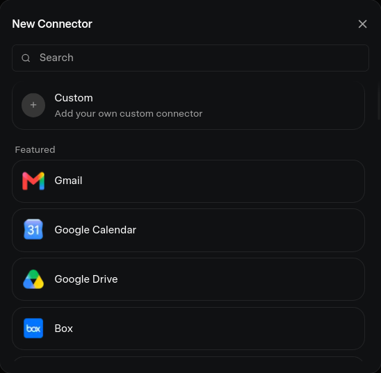
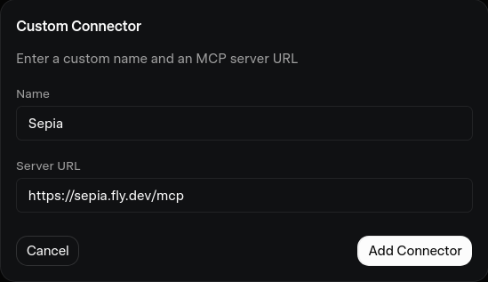
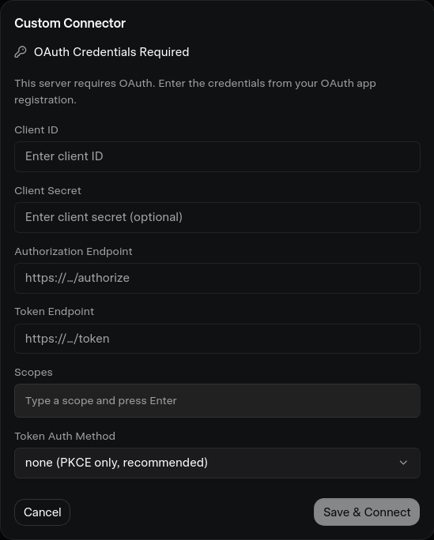

# Connecting Sepia to Grok (Custom MCP Connector)

> **Status: OAuth 2.1 is live.** The server (`https://sepia.fly.dev`) runs a built-in
> OAuth 2.1 + PKCE authorization server (`@tmcp/auth`). Grok auto-detects it and you
> sign in with a browser — no manual credentials to fill in.

Grok supports "bring your own MCP" connectors. Because Grok runs from its own cloud, it needs
the server to be publicly reachable (it is) and to authenticate via OAuth 2.1.

## What you'll see

### 1. Open New Connector

Go to `grok.com/connectors` → **New Connector** → **Custom**.

### 2. Name it and paste the MCP URL

Enter a name (e.g. `Sepia`) and the server URL `https://sepia.fly.dev/mcp`, then **Add Connector**.

### 3. Grok detects OAuth and opens the browser sign-in

Grok probes the server's OAuth metadata (`/.well-known/oauth-protected-resource`), then opens
Sepia's login + consent page in your browser.

### 4. Enter your Sepia password

The consent page shows which client is requesting access, the scopes it wants
(`memory:read`, `memory:write`), and where it will redirect. Enter the **dashboard password**
(`DASHBOARD_PASSWORD`) and click **Authorize**.

You're redirected back to Grok, which exchanges the code for tokens and connects. Done —
Grok can now use your memory server.

## How it works under the hood

- **No manual client registration.** Grok presents its `client_id` as an HTTPS URL; Sepia
  fetches Grok's Client ID Metadata Document (the MCP `2026-07-28` spec's replacement for
  dynamic client registration).
- **PKCE enforced** (S256) on every authorization code exchange.
- **Tokens survive scale-to-zero.** Access tokens (1 h) and rotating refresh tokens (30 d)
  are stored in Postgres, so Grok stays connected even after the Fly VM cold-starts.
- **Bearer-token clients are unaffected.** Claude Code, Cursor, Zed, and Copilot keep using
  the static `Authorization: Bearer` header — both auth modes work side by side.

## Verify it's working

| Probe                                                              | Expected result                                 |
| ------------------------------------------------------------------ | ----------------------------------------------- |
| `GET https://sepia.fly.dev/`                                       | `"auth":"oauth-2.1"`                            |
| `GET https://sepia.fly.dev/.well-known/oauth-authorization-server` | JSON metadata (issuer, endpoints)               |
| `GET https://sepia.fly.dev/.well-known/oauth-protected-resource`   | JSON metadata (resource, authorization_servers) |

## Troubleshooting

- **"OAuth Credentials Required" form still appears** — the server hasn't been redeployed
  with OAuth yet, or `DASHBOARD_PASSWORD` isn't set on Fly (OAuth is disabled without it).
  Check `GET https://sepia.fly.dev/` → `"auth"` field.
- **Wrong password on the consent page** — it's the `DASHBOARD_PASSWORD` Fly secret, not
  your Grok password (and not the dashboard token).
- **Connection drops after idle** — normal for scale-to-zero; Grok silently refreshes with
  the refresh token. If it asks to re-authorize, the refresh token expired (30 days) or the
  DB was reset.
